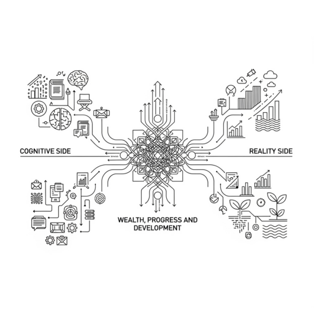

# Cartilla minima para razonar sobre  el desarrollo economico: marcos y modelos

> We propose a **framework** to understand how societies **think** and **act** to transform their conditions and pursue development—both by **convergence** and **fronteir progress**. To do this, we take an abstract view of society and change, analyzing the **space of societies** and the dynamics of **economic transformation in a given society**.

> **Note:** This is a draft. We've focused first on the structure and conceptual architecture of the document, but it still needs to be filled with rigorous and meaningful content to reach its full potential.

## Abstract

> In this document, we propose an **abstract framework** for thinking about wealth & **development (convergence and  progress)**. The framework is organized around two deeply interconnected themes: the **Cognitive Side**—how societies think about wealth, development, and themselves—and the **Reality Side**—the material structures of wealth, production, and constraints that shape developmental possibilities. Between these lies the **intersection (operational interface)**, where cognition meets reality `thereby enabling` strategy, action, organization and feedback  in order to `transform reality` in a way that solves **economic development problems (convergence &  global frontier progress)**.

### Framework Architecture

#### 👁️ Observing Society

> This section focuses on understanding the structural, cultural, institutional, and historical dimensions of societies as a foundation for reasoning about development. Observing society involves analyzing how people organize themselves, how institutions emerge and evolve, and how values, norms, and power relations shape collective behavior. It is the first step in identifying the constraints, opportunities, and trajectories available to a given society.

#### 🏗️ Reality Side

> The material structures and constraints that shape development possibilities.

- Development Problem Formulation
- Wealth: Human Capital, Technology, Markets and  Production Systems
- Measuring Development
- Structure of the Development Process
- **Development Environment & Constraints** (Structural, Institutional, Temporal)

#### 🧠 Cognitive Side

> How societies think—about themselves, others, and development.

- Collective Self-Cognition Model
- Collective Cognition of Others

#### 🔄 Operational Intersection Layer

> Where cognition meets structure to produce action.

- Strategic Action Space
- Organizational Architecture
- **Strategic Layer** (Principles, Long-term vision & direction)
- **Programmatic Layer** (Policy, planning, prioritization)
- **Tactical Layer** (Execution & adjustment)
- **Reflective Layer** (Monitoring, learning, adaptation)

## 👁️ Observing Society

> To construct a framework for reasoning about development, we begin by examining society and change—analyzing the space of societies and the dynamics of economic transformation within a given society.

| **Category** | **Tool** | **Concise Description** |
|--------------|----------|--------------------------|
| **Causal & Diagnostic Tools** | Feedback Loops | Mechanisms where outputs of a system influence its own inputs; can stabilize (negative) or amplify (positive) dynamics. |
| | Capability Traps | Situations where weak institutions and low capabilities reinforce each other, making improvement difficult. |
| | Bottlenecks & Constraints | Analytical approach to identify key limiting factors to growth or transformation. |
| | Hysteresis | A situation where changes are not easily reversible—past states influence present outcomes. |
| | Equilibrium / Disequilibrium | States where forces balance (or don’t); helps explain stability or instability of a system. |
| | Structural Breaks | Discontinuous changes in systems or trends, often associated with crises or transformations. |
| | Complexity & Emergence | Views systems as adaptive, non-linear, and path-dependent; outcomes emerge from interactions, not single causes. |
| **Strategic & Decision Tools** | Theory of Change | A framework to model how specific actions are expected to produce desired changes across a system. |
| | Strategy vs Tactics | Distinction between long-term objectives and short-term methods or maneuvers to achieve them. |
| | Leverage Points | Places in a system where a small intervention can produce large and lasting change. |
| | Windows of Opportunity | Periods of alignment (political, social, economic) that allow reforms or transformation to succeed. |
| | Strategic Sequencing | The ordering of interventions to maximize impact or avoid backlash/failure. |
| **Process Dynamics & Lock-in** | Path Dependency | Historical sequences that constrain or enable future options, making change harder over time. |
| | Lock-in | Processes that reinforce the dominance of specific technologies, behaviors, or institutions. |
| | Diffusion | How innovations, practices, or institutions spread across a system or between countries. |
| | Adaptation | The capacity of actors or systems to adjust behavior in response to changes in environment or incentives. |
| | Co-evolution | Mutually shaping evolution of institutions, technologies, and norms over time. |
| **Institutional & Political Tools** | Institutional Isomorphism | Tendency of organizations or states to mimic others due to legitimacy, norms, or pressures, not effectiveness. |
| | Political Settlements | Stable distributions of power that determine how institutions work and how resources are allocated. |
| | Embeddedness | The degree to which institutions and actors are rooted in particular social or historical contexts. |
| | Institutional Inertia | The resistance of institutions to change due to habits, norms, routines, or interests. |
| | Informal Institutions | Rules and practices not codified but still powerful in shaping outcomes. |

## 🏗️ Reality Side

> The material structures and constraints that shape development possibilities.

### Development Problem Formulation

> **Human groups** face various **material constraints** that limit access to essentials such as food intake, shelter, transportation, communication, and other vital resources. Despite these limitations, some societies manage to overcome scarcity and generate abundance and wealth. This transformation is largely driven by the creation and adoption of new technologies.

> A key example from the medieval period is the introduction of the **heavy plow** and the **three-field crop rotation system** in Northern Europe. The heavy plow made it possible to till the dense, clay-rich soils of the north more effectively than earlier tools, while the three-field system increased land productivity by rotating crops across three plots—one with a winter crop, one with a spring crop, and one left fallow. This combination increased yields, reduced soil exhaustion, and allowed for more reliable food supplies. The resulting surplus supported population growth, urbanization, and the revival of trade and markets.

Problem Definition:

- The **economic development problem** centers on mobilizing and enhancing human potential to transform material constraints into sustained growth, increased productivity, and long-term improvements in well-being.

- The **convergence problem** *(or catching-up challenge)* involves designing and implementing strategies that enable late-developing societies to absorb, adapt, and internalize the technological and organizational foundations of modern production—eventually reaching the capacity to generate frontier innovations and create new technological paradigms.

- The **frontier progress problem** *(leapfrogging and innovation leadership)* consists in advancing beyond existing global capabilities by generating novel technologies, redefining product categories, and shaping new productive trajectories—often under uncertainty and structural inertia.

### Wealth: Human Capital, Technology, Markets and  Production Systems

> Understanding how societies generate and sustain wealth requires examining the complex interplay between goods, productive capabilities, and the structures that support economic activity. Wealth creation is not a singular process; it can emerge through various pathways—ranging from the adoption and innovation of productive technologies to the extraction and transformation of natural resources. This section explores these different modes of wealth generation, highlighting how the development of capabilities and the strategic management of resources underpin long-term economic progress and resilience.

#### Paths of Wealth

1. **Adoption of productive capabilities** — This refers to the development of technologies, institutions, skills, and infrastructure that transform how resources are used, enabling sustained increases in productivity, innovation, and economic complexity. This is the foundation of long-term, endogenous wealth creation.
2. **Creation of new productive capabilities** — This refers to the development of technologies, institutions, skills, and infrastructure that transform how resources are used, enabling sustained increases in productivity, innovation, and economic complexity. This is the foundation of long-term, endogenous wealth creation.
3. **Extraction and Exploitation of Existing Resources** — This refers to drawing on natural endowments such as fertile land, mineral reserves, forests, or advantageous trade positions—often in relation to countries that possess the technological capacity to generate material abundance. While this path can yield short-term wealth, it is constrained by resource depletion, diminishing returns, and vulnerability to external dependencies and price fluctuations.
4. **Hybrid Resource-Industrial Systems** — In this model, wealth is generated by combining resource extraction with the domestic development of technological and industrial capabilities. Rather than exporting raw materials, the focus is on building value chains that include semi-processing, refining, and eventually advanced transformation of natural resources. If well-managed, this pathway can serve as a transitional platform toward broader productive diversification.

#### On The Role of Technology

> Technology (from the Greek techne, meaning “art” or “craft”) forms the foundation of productive capabilities and drives the processes of production, generating both goods—technical objects or otherwise—and services.

> **Note**: Technology should not be confused with technical objects themselves; rather, it encompasses the knowledge, methods, and processes behind their creation and use.

### Measuring Development

> To understand and guide development effectively, it is essential to measure its multiple dimensions. Development is not a single indicator but a complex, evolving process involving economic transformation, social progress, institutional quality, technological advancement, environmental sustainability, and human agency. This section outlines a comprehensive set of metrics used to assess the structure, depth, and trajectory of development in a society. These indicators help identify strengths, bottlenecks, and strategic opportunities for long-term progress.

| **Category**                     | **Metric**                            | **Description**                                                                | **Goal**                                                    |
| -------------------------------- | ------------------------------------- | ------------------------------------------------------------------------------ | ----------------------------------------------------------- |
| **Economic Structure**           | GDP per Capita                        | Total economic output divided by population.                                   | Assess overall income and productivity levels.              |
|                                  | Economic Complexity Index (ECI)       | Captures the diversity and sophistication of a country's productive structure. | Identify structural transformation and knowledge intensity. |
|                                  | Export Diversification Index          | Measures the variety and concentration of exports.                             | Evaluate resilience and structural upgrading of trade.      |
|                                  | Domestic Value Added in Exports       | Share of exports produced locally (vs. imported inputs).                       | Measure local integration and industrial depth.             |
|                                  | Sectoral Value-Added Share            | GDP share from agriculture, industry, and services.                            | Understand structural composition of the economy.           |
| **Social Wellbeing**             | Human Development Index (HDI)         | Composite of life expectancy, education, and income.                           | Assess overall human development progress.                  |
|                                  | Multidimensional Poverty Index (MPI)  | Accounts for health, education, and standard of living deprivations.           | Identify deep and layered poverty beyond income.            |
|                                  | Gini Coefficient                      | Measures income inequality.                                                    | Track distributive equity.                                  |
|                                  | Social Mobility Index                 | Measures access to opportunity over time and generations.                      | Evaluate inclusiveness and fairness of development.         |
| **Institutional Quality**        | Government Effectiveness              | Perceived quality of public services and civil service.                        | Assess state capacity to implement policy.                  |
|                                  | Rule of Law                           | Measures legal predictability, contract enforcement, and property rights.      | Gauge institutional trust and stability.                    |
|                                  | Corruption Perception Index (CPI)     | Survey-based corruption perception.                                            | Assess integrity and transparency in institutions.          |
| **Technological Progress**       | R\&D Expenditure (% of GDP)           | National spending on research and development.                                 | Measure innovation potential.                               |
|                                  | Patents per Capita                    | New patents granted relative to population.                                    | Track knowledge generation and tech activity.               |
|                                  | Digital Infrastructure Index          | Availability and use of digital technology.                                    | Assess digital readiness and inclusion.                     |
| **Environmental Sustainability** | CO₂ Emissions per Capita              | Carbon footprint per person.                                                   | Measure environmental cost of development.                  |
|                                  | Renewable Energy Share                | % of total energy from renewable sources.                                      | Evaluate green transition and resilience.                   |
|                                  | Environmental Performance Index (EPI) | Composite index on air, water, biodiversity, etc.                              | Assess environmental governance and outcomes.               |
| **Capability & Agency**          | Education Attainment Index            | Average years of schooling and expected years.                                 | Track human capital formation.                              |
|                                  | Labor Force Participation Rate        | Share of working-age population employed or seeking employment.                | Evaluate access to economic agency.                         |
|                                  | Civic Participation Index             | Measures political engagement and civil society activity.                      | Assess societal agency and democratic depth.                |

### Structure of the Development Process

> How does a phase transition occur in the development process? What should be the pace of changes in development? What characteristics make changes significant and how deep must they be to trigger a phase transition? How broad and deep should they be? Can the market alone **coordinate development?**

> The **development process** is a complex adaptive socio-technical system characterized by the dynamic interaction and co-evolution of heterogeneous agents, institutional arrangements, and technological subsystems within multiscalar temporal and spatial contexts. It encompasses the **continuous transformation of the system’s state vector**—representing economic, social, political, and infrastructural variables—through endogenous and exogenous inputs, governed by non-linear feedback loops and subject to path dependency and structural constraints.

Formally:

* Let the **state space** $S(t) \subseteq \mathbb{R}^n$ represent the vector of key development indicators (e.g., GDP per capita, human capital index, institutional quality metrics, technological capability indices).

* The evolution of $S(t)$ is described by a dynamical system:

$$
\frac{dS}{dt} = F(S(t), I(t), E(t), \theta)
$$

where:

* $F$ is a non-linear vector-valued function encoding the system’s endogenous growth dynamics, incorporating production functions, innovation diffusion, institutional feedback, and social capital formation.

* $I(t)$ represents **institutional configurations and policy parameters** acting as control variables shaping incentives and transaction costs.

* $E(t)$ denotes **exogenous environmental factors** including global market conditions, geopolitical influences, and resource availability.

* $\theta$ is a vector of system parameters reflecting technological capabilities, cultural norms, and infrastructure quality.

#### Dimension

| **Dimension**                    | **Key Questions**                                                                     | **Representative Theories or Models**                                               |
| -------------------------------- | ------------------------------------------------------------------------------------- | ----------------------------------------------------------------------------------- |
| **Meta-Cognitive Layer**         | How do societies collectively learn, reflect, and adapt their development paradigms?  | Reflexive Modernization, Social Learning Theory                                     |
| **Productive Structure**         | What is produced, by whom, and through which systems?                                 | Structuralism; Capabilities Approach (Hausmann, Hidalgo)                            |
| **Learning & Capacity Building** | How are skills, knowledge, and capabilities accumulated and diffused?                 | Human Capital Theory; Organizational Learning; NSI (National Systems of Innovation) |
| **Frontier Innovation Capacity** | What is the country’s ability to generate and absorb cutting-edge technologies?       | Evolutionary Economics; Technology Gap Theory                                       |
| **Institutional Capacity**       | What formal and informal rules, norms, and enforcement mechanisms shape development?  | New Institutional Economics (North); Rodrik’s Trilemma                              |
| **Technological Base**           | What is the level, direction, and dynamism of technological change?                   | Evolutionary Economics; Nelson & Winter’s NSI                                       |
| **Social Integration**           | Who benefits from development and how inclusive is the process?                       | Sen’s Capabilities Approach; Social Cohesion Theory; Welfare Economics              |
| **Geopolitical Position**        | What is the country’s role and influence within the global political-economic system? | Dependency Theory; World-Systems Theory                                             |
| **Environmental Limits**         | Is development ecologically sustainable within planetary boundaries?                  | Planetary Boundaries Framework; Doughnut Economics                                  |

#### Characteristics

| **Characteristic** | **Description** |
| --- | --- |
| **Phase Transitions & Emergent Properties** | Development involves critical thresholds where incremental changes lead to qualitative systemic transformations. |
| **Path Dependence & Lock-in Effects** | Historical legacies and existing structures constrain future development trajectories and shape institutional and technological evolution. |
| **Multi-Level Feedback Loops** | Micro-level behaviors aggregate to macro-level outcomes, which recursively influence agent incentives and institutions. |
| **Adaptive Learning & Evolution** | Continuous accumulation of capabilities and institutional adaptation through innovation and knowledge diffusion. |
| **Constraint Interaction** | Development is shaped by intertwined structural and temporal constraints affecting growth and responsiveness. |
| **Co-evolution of Subsystems** | Economic, social, political, technological, and environmental subsystems evolve interdependently, requiring integrated policies. |
| **Market Coordination Limits** | Markets alone often fail to coordinate complex development processes due to externalities and institutional voids, requiring governance. |

### **Development Environment & Constraints** (Structural, Institutional, Temporal)

> Constraints are not excuses; they are the design space within which a society can act.

> Development does not unfold in a vacuum—it is shaped by a layered environment of **constraints** and **possibilities**. These constraints are not merely obstacles, but the structural contours that define the space within which a society imagines, plans, and enacts transformation. Understanding these dimensions—**structural**, **institutional**, and **temporal**—is key to designing viable pathways for progress.

#### 🏗 Structural Constraints

| **Dimension**                   | **Observable Examples**                                                            | **Quick Indicators**                                                        |
| ------------------------------- | ---------------------------------------------------------------------------------- | --------------------------------------------------------------------------- |
| **Physical Geography**          | Distance from markets, landlocked/island with no deepwater port, altitude, climate | Weighted distance to large consumer markets (CEPII), % of land above 2,000m |
| **Resource Endowment**          | Oil, lithium, volcanic soils, constant coastal winds                               | Share of commodities in exports (UN-COMTRADE), export concentration index   |
| **Demography**                  | Demographic window, urban density, skilled diaspora                                | Dependency ratio < 0.5, % of population aged 25–34 with tertiary education  |
| **Position in Global Networks** | Air hubs, submarine cables, IP treaties                                            | Number of direct container routes, firms in TRIPS-Plus agreements           |

#### 🏛 Institutional Constraints

| **Type**                  | **Examples**                                                                         | **Diagnostic Tool**                                              |
| ------------------------- | ------------------------------------------------------------------------------------ | ---------------------------------------------------------------- |
| **Formal Institutions**   | Constitution, antitrust laws, fiscal rules, intellectual property regimes            | Regulatory Quality Index (ICRG)                                  |
| **Informal Institutions** | Clientelist networks, norms of cooperation, defeatist narratives ("we’re not Japan") | Ethnographic Policy Mapping (EPM) – 6 semi-structured interviews |
| **State Capacity**        | Critical mass of analysts, staff turnover, open data infrastructure                  | # of public officials with STEM PhDs per 100,000 inhabitants     |
| **Political Settlement**  | *Political settlement* – distribution of power among elites                          | Veto player matrix (World Bank PEFA)                             |

#### ⏳ Temporal Constraints

| **Phenomenon**                       | **Typical Duration** | **Example of Strategic Use**                                           |
| ------------------------------------ | -------------------- | ---------------------------------------------------------------------- |
| **Demographic Window**               | 25–30 years          | South Korea (1965–1990): scaled labor-intensive manufacturing          |
| **Commodity Cycle**                  | 7–10 years           | Chile (2003–2013): mining royalty → innovation fund (CORFO)            |
| **Global Technology Adoption Cycle** | 15–20 years          | 4G mobile Internet penetration (2008–2023)                             |
| **Electoral Horizon**                | 4–6 years            | Uruguay: 2009 party law locked in R\&D targets across political cycles |

## 🧠 Cognitive Side

> How societies think—about themselves, others, and development.

> What is the relationship and dynamic between society, the economy, and development? Is society and the economy a complex and adaptive phenomenon? What is the role of institutions? What is the relationship between techno-productive and social coevolution?

- Collective Self-Cognition Model
- Collective Cognition of Others
- Modelling The Dyanmics of Perception & Response of Progress Asymmetry

### Collective Self-Cognition & Otherness Model

> A unified framework to understand how Society B perceives its developmental inferiority relative to Society A, processes that perception through cultural and cognitive filters, and generates systemic responses—strategic, emotional, or ideological.

> `Observer/s ->  Perception ->  [Processing] ->  Response -> Feedback`.

> How societies think and response to other societies progress?

> Model(We) vs Model (the Other)

- **Bourdieu**: The asymmetry is habituated into the collective doxa via symbolic capital.
- **Social Comparison Theory (Festinger)**: Societies assess themselves through others, generating aspiration or resentment.
- **Mimetic Desire (Girard)**: Societies desire what others desire/have, leading to emulation or rivalry.
- **Systems Theory**: Society B's reaction depends on internal feedback loops, stability, and identity.
- **Developmental Ideology**: Societies with strong endogenous development ideologies are more likely to act.

| **Stage**                | **Type**                   | **Description**                                                                                                                                          | **Sample Questions**                                                                                          |
| ------------------------ | -------------------------- | -------------------------------------------------------------------------------------------------------------------------------------------------------- | ------------------------------------------------------------------------------------------------------------- |
| **Contact Layer**     | *Perception*               | Initial sensory or symbolic exposure to Society A. May include material (technology), institutional (governance), or symbolic (language, media) signals. | How visible is A? Through what channels? What is emphasized—wealth, efficiency, values, aesthetics?           |
| **Contrast Layer**    | *Perception*               | Recognition of qualitative difference or superiority. Salient differences framed cognitively as gaps, lacks, or impossibilities.                         | In what dimensions does B feel inferior? Is the gap material, moral, spiritual, aesthetic, or all?            |
| **Causal Layer**      | *Cognitive Framing*        | Society B constructs theories of why the asymmetry exists. Includes internalist, externalist, structural, or divine/moral explanations.                  | Why is A ahead? Is it due to exploitation, better institutions, luck, or divine will?                         |
| **Affective Layer**   | *Emotional Response*       | Affective orientation to asymmetry: admiration, humiliation, envy, indifference, resentment, prideful rejection.                                         | Is the feeling one of aspiration, defeat, anger, or determination? Is it elite-only or widespread?            |
| **Ontological Layer** | *Identity Processing*      | Asymmetry is integrated into or rejected from B’s self-image. Identity either adapts to or resists the perceived status differential.                    | Does B internalize inferiority? Reframe development? See itself as destined to lag—or as uniquely valuable?   |
| **Diagnostic Layer**  | *Problem Recognition*      | Recognition of B’s underdevelopment as a systemic condition. May involve technical, moral, or political diagnosis.                                       | Is backwardness seen as a problem? If so, what’s to blame: the system, the elites, the people, the culture?   |
| **Strategic Layer**   | *Response Formation*       | Based on perception and diagnosis, B formulates strategies: mimicry, rejection, hybridization, indifference, or resistance.                              | Is there a desire to catch up or follow a different path? Are responses elite-led, bottom-up, or fragmented?  |
| **Operational Layer** | *Execution & Mobilization* | Concrete implementation: reforms, institutions, educational changes, industrial policy, or rhetorical campaigns.                                         | Can the state or society act on this vision? Is it effective or performative? Is there elite and mass buy-in? |
| **Feedback Layer**    | *Systemic Adaptation*      | Outcomes reinforce or challenge the original perception. Failure or success of response alters the next cycle of perception and strategy.                | Does action lead to pride, despair, anger? Is the asymmetry reaffirmed, reduced, or reframed?                 |

### Case Studies

| **Society B**       | **Society A** | **Response**                                          |
| ------------------- | ------------- | ----------------------------------------------------- |
| **Japan (1860s)**   | West          | Strategic mimicry (Meiji Restoration)                 |
| **India (20th c.)** | Britain       | Mixed: Admiration, resistance, eventual hybridization |
| **Brazil (today)**  | OECD nations  | Often passive mimicry, low national consensus         |
| **China (1978–)**   | U.S. / Japan  | Competitive mimicry + techno-nationalism              |
| **Cuba (1959–)**    | U.S.          | Rejection + alternative ideology                      |

## 🔄 Operational Intersection Layer

> Where cognition meets reality to produce action.

> **Policy** sets the vision and goals.

> **Strategy** frames how to achieve the vision.

> **Tools** are policy categories (the “what”).

> **Mechanisms** are institutional arrangements and processes (“how”).

> **Tactics** are on-the-ground actions.

> **M&E** informs all levels by providing feedback and enabling course correction.

### Strategic Action Space

> **Note**: This is a preliminary sketch of the space; refinement and expansion are expected.

| **Category**                      | **Action**                             | **Description**                                                                                | **Goal**                                                                     |
| --------------------------------- | -------------------------------------- | ---------------------------------------------------------------------------------------------- | ---------------------------------------------------------------------------- |
| **Institutional Foundations**     | Legal-Institutional Reform             | Strengthen property rights, contracts, regulatory quality, and enforcement capacity            | Enable trust, reduce transaction costs, and foster productive investment     |
|                                   | Governance & Bureaucratic Capability   | Build a meritocratic, learning-oriented public administration                                  | Ensure policy continuity and effective implementation                        |
| **Firm & Entrepreneurial Growth** | SME Support & Formalization            | Support small and medium-sized enterprises through access to finance, markets, and compliance  | Strengthen domestic business base and reduce informality                     |
|                                   | Business Environment Reform            | Streamline licensing, reduce red tape, and improve regulatory transparency                     | Encourage entrepreneurship and attract productive investment                 |
|                                   | Cluster & Network Development          | Facilitate inter-firm cooperation and linkages within industrial ecosystems                    | Build competitive advantages through agglomeration and collective efficiency |
|                                   | Firm Capability Upgrading              | Promote quality standards, productivity benchmarking, and managerial training                  | Enhance firm-level competitiveness and resilience                            |
| **Export Capacity & Trade**       | Export Promotion                       | Offer services to firms for market intelligence, certification, and logistics                  | Increase export diversification and market access                            |
|                                   | Trade Facilitation                     | Simplify customs, ports, and trade-related infrastructure                                      | Reduce trade costs and enable integration into global value chains           |
|                                   | Strategic Export Strategy              | Identify priority products and markets, align support tools accordingly                        | Target high-potential export sectors with coordinated state support          |
|                                   | Foreign Market Development             | Support internationalization through diplomacy, diaspora networks, and promotional missions    | Expand firm presence abroad and strengthen national brand                    |
| **Production Structure Upgrade**  | Industrial Policy                      | Target support to priority sectors with high potential for learning and spillovers             | Transform production structure toward higher value-added and complexity      |
|                                   | Technology Extension Services          | Offer public or hybrid technical assistance to firms for technology adoption                   | Accelerate diffusion of best practices and process improvements              |
|                                   | Supply Chain Deepening                 | Localize upstream and downstream linkages around key industries                                | Increase domestic value capture and reduce import dependence                 |
| **Innovation & Technology**       | Applied R\&D Programs                  | Support firm-research partnerships and problem-solving research                                | Build innovation capacity tied to real economic needs                        |
|                                   | Technology Transfer Platforms          | Use incubators, accelerators, licensing support, and tech parks                                | Facilitate knowledge flow and commercialization                              |
|                                   | Digitalization Incentives              | Support digital tools adoption in traditional and new sectors                                  | Improve productivity and innovation in services and manufacturing            |
| **Human Capital & Learning**      | Workforce Development                  | Align skills training with sectoral needs (STEM, technical, soft skills)                       | Create a labor force able to support complex, evolving production structures |
|                                   | Management & Entrepreneurial Training  | Programs to improve strategic, operational, and innovation skills in firms                     | Professionalize enterprise leadership and decision-making                    |
| **Finance for Development**       | Development Banking                    | Channel long-term finance to strategic sectors and infrastructure                              | Overcome capital market failures and support structural transformation       |
|                                   | Export & Investment Credit Instruments | Provide insurance, guarantees, and financing for exporters and investors                       | Reduce risk and enable scaling of productive activities                      |
|                                   | Venture Capital Ecosystem              | Foster innovation by supporting risk capital markets for startups and high-growth firms        | Accelerate entrepreneurship and breakthrough technologies                    |
| **Territorial Development**       | Local Economic Development             | Empower subnational governments and local actors in economic planning                          | Reduce regional inequality and leverage localized strengths                  |
|                                   | Strategic Urban Industrial Planning    | Develop productive cities with mixed-use zones and infrastructure                              | Foster urban-based productivity and innovation ecosystems                    |
| **Environmental Transition**      | Green Export Development               | Support sectors with sustainable, low-carbon export potential                                  | Position the country in future-oriented global markets                       |
|                                   | Eco-Industrial Parks                   | Combine industrial agglomeration with resource efficiency and sustainability standards         | Promote circular economy principles in industrial growth                     |
| **Coordination & Strategy**       | Mission-Oriented Planning              | Define cross-sectoral missions (e.g., net-zero energy, health industry) and align institutions | Coordinate public and private actors around shared national goals            |
|                                   | Strategic Foresight & Learning Systems | Build anticipatory capacity and reflexive evaluation mechanisms                                | Enable adaptive governance in a changing global context                      |

### Tool & Mechanism Space

> How to implement reality?

| **Strategic Objective**                         | **Policy Tool**                       | **Mechanism / Operational Levers**                                                                                                                                           | **Implementation Notes / Success Conditions**                                                                           |
| ----------------------------------------------- | ------------------------------------- | ---------------------------------------------------------------------------------------------------------------------------------------------------------------------------- | ----------------------------------------------------------------------------------------------------------------------- |
| **Maximize Developmental Impact of FDI**        | **FDI Management & Conditionality**   | - Screening and approval systems    - Local content requirements    - Technology transfer clauses    - Joint venture incentives                                     | Requires strong administrative capacity and sector-specific knowledge; may conflict with WTO rules if not well-designed |
| **Build Domestic Industrial Champions**         | **State-Owned Enterprises (SOEs)**    | - Direct state ownership in strategic sectors    - Performance contracts    - Public-private partnerships                                                              | Effective if embedded in competitive markets, subject to performance oversight, and not politicized                     |
| **Leverage State Buying Power for Development** | **Public Procurement Systems**        | - Local supplier preference laws    - Innovation procurement    - Pre-commercial procurement platforms                                                                 | Must be transparent, rule-based, and protected against capture or corruption                                            |
| **Channel Finance into Productive Sectors**     | **Development Banks & Fiscal Policy** | - Long-term sectoral loans    - Credit guarantees    - Countercyclical investment stimulus    - Tax expenditure for innovation                                      | Requires risk management tools, clear mandates, and alignment with industrial strategy                                  |
| **Shape Markets & Incentives**                  | **Regulatory Design and Reform**      | - Strategic deregulation (e.g. SME formalization)   - Performance-based standards    - Sandbox regulation for tech    - Sectoral regulators with technical autonomy | Impact depends on regulatory quality, institutional coordination, and enforcement mechanisms                            |

### Organizational Architecture

| **Category**                 | **Institution**                             | **Description**                                                                                  | **Goal**                                                        |
| ---------------------------- | ------------------------------------------- | ------------------------------------------------------------------------------------------------ | --------------------------------------------------------------- |
| **Government Agencies**      | Ministry of Economy / Planning              | Central bodies responsible for formulating economic policy, strategies, and coordinating sectors | Design coherent development plans and policy alignment          |
|                              | Ministry of Finance                         | Manages public finances, budgeting, and fiscal policy                                            | Ensure sustainable financing and macroeconomic stability        |
|                              | Ministry of Trade & Industry                | Regulates trade policy, industrial promotion, and investment climate                             | Promote competitive industries and favorable trade conditions   |
|                              | Development Banks                           | State-owned or semi-autonomous banks providing long-term finance and credit guarantees           | Mobilize finance for strategic sectors and infrastructure       |
|                              | Regulatory Authorities                      | Independent or semi-independent agencies regulating competition, sector standards, licenses      | Ensure fair markets, consumer protection, and sector efficiency |
| **Public Enterprises**       | State-Owned Enterprises (SOEs)              | Government-owned companies active in strategic sectors like energy, transport, or telecom        | Drive industrial policy objectives and fill market gaps         |
| **Research & Innovation**    | National Research Councils / Institutes     | Public research bodies supporting R\&D, technology development, and innovation policy            | Generate knowledge and promote technology diffusion             |
|                              | Innovation Agencies                         | Agencies managing grants, incubators, and technology parks                                       | Facilitate firm upgrading and entrepreneurship                  |
| **Trade & Export Support**   | Export Promotion Agencies                   | Institutions that support exporters with market intelligence, certification, and logistics       | Expand export capacity and diversification                      |
| **Social Institutions**      | Labor Ministries / Employment Agencies      | Manage labor market regulations, workforce training, and employment services                     | Improve workforce skills and labor market functioning           |
|                              | Social Protection Agencies                  | Provide safety nets, welfare programs, and poverty alleviation                                   | Promote social inclusion and reduce vulnerability               |
| **Coordination Platforms**   | Economic Development Councils / Commissions | Multi-stakeholder bodies coordinating public-private cooperation and strategic planning          | Align stakeholders and enhance policy coherence                 |
| **Judiciary & Legal System** | Courts and Arbitration Bodies               | Institutions responsible for contract enforcement, dispute resolution, and rule of law           | Provide legal certainty and enforce property rights             |

### Strategic Layer (Long-term vision & direction)

Here’s a clear and precise definition for the:

### Strategic Layer (Long-term vision & direction)

---

The **Strategic Layer** represents the highest level of planning in development policy. It sets the **long-term vision, fundamental goals, and overarching direction** for national or regional development efforts. This layer defines **where the country or region aims to be** in the medium to long run (typically 10–30 years), articulating the desired structural transformation, economic diversification, social inclusion, and sustainability objectives.

**Key features:**

* **Vision-setting:** Establishes aspirational and normative goals aligned with national values and global commitments (e.g., sustainable development, industrial modernization).
* **Priority Framework:** Identifies priority sectors, capabilities, and cross-cutting challenges to focus resources and efforts.
* **Guiding Principles:** Frames policy coherence and alignment across ministries, agencies, and stakeholders.
* **Adaptive Orientation:** Recognizes uncertainties and fosters flexibility to adjust pathways as new information and conditions arise.
* **Coordination & Leadership:** Provides a mandate for coordinated multi-sectoral planning and investment, involving public and private actors.

**Outputs at this layer typically include:**

* National development plans and visions
* Long-term sectoral strategies
* Strategic frameworks for innovation, industrialization, or green transition
* Institutional mandates for cross-cutting coordination bodies

### Programmatic Layer (Policy, planning, prioritization)

> The **Programmatic Layer** translates the long-term strategic vision into **concrete policy frameworks, detailed planning, and prioritized action areas**. This layer operates at the medium-term horizon (typically 3–7 years) and provides the **roadmap for achieving strategic goals** by specifying which sectors, programs, and initiatives will receive focus and resources.

**Key features:**

* **Policy Formulation:** Develops detailed policies aligned with the strategic vision, specifying objectives, targets, and instruments.
* **Sectoral & Thematic Planning:** Breaks down strategy into sector-specific plans (e.g., manufacturing, agriculture, digital economy) and cross-cutting themes (e.g., skills development, climate resilience).
* **Resource Prioritization:** Allocates budgets and mobilizes financing to priority programs and projects with expected high impact.
* **Coordination Mechanisms:** Defines roles, responsibilities, and governance structures to ensure coherent implementation across agencies.
* **Monitoring Frameworks:** Establishes indicators and milestones to track progress and adjust plans as needed.

**Outputs at this layer typically include:**

* National and sectoral development policies
* Medium-term development plans and investment programs
* Policy frameworks for innovation, trade, infrastructure, social inclusion
* Coordination platforms and governance guidelines

### Tactical Layer (Execution & adjustment)

The **Tactical Layer** focuses on the **day-to-day implementation, management, and adaptive adjustment** of development policies and programs. Operating at the short-term and operational horizon (typically monthly to yearly), this layer ensures that plans and strategies translate into concrete actions, while remaining flexible to respond to emerging challenges and opportunities.

**Key features:**

* **Program Implementation:** Carries out projects, initiatives, and interventions as defined by programmatic plans.
* **Resource Management:** Oversees budgeting, procurement, staffing, and logistics needed for effective delivery.
* **Monitoring & Feedback:** Collects real-time data on progress, outputs, and outcomes to inform timely adjustments.
* **Problem Solving & Adaptation:** Identifies bottlenecks, risks, and changing conditions, enabling responsive course corrections.
* **Stakeholder Engagement:** Coordinates with beneficiaries, private sector, local governments, and civil society to ensure relevance and impact.

**Outputs at this layer typically include:**

* Project execution reports and operational dashboards
* Adaptive management decisions and revised workplans
* Field-level coordination meetings and stakeholder consultations
* Capacity-building activities and troubleshooting documentation

### Reflective Layer (Monitoring, learning, adaptation)

> The **Reflective Layer** focuses on the continuous **monitoring, evaluation, learning, and adaptive management** of development policies and programs. It ensures that development efforts remain effective, relevant, and responsive by providing evidence-based feedback loops that inform decision-making at all other layers.

**Key features:**

* **Data Collection & Analysis:** Systematic gathering and analysis of quantitative and qualitative data on policy implementation and outcomes.
* **Performance Monitoring:** Tracking progress against targets, milestones, and indicators defined in the programmatic and strategic layers.
* **Impact Evaluation:** Assessing the effectiveness, efficiency, and equity of policies and programs.
* **Learning & Knowledge Management:** Capturing lessons learned, best practices, and innovations to improve future actions.
* **Adaptive Governance:** Facilitating timely course corrections and policy adjustments in response to feedback and changing contexts.
* **Stakeholder Engagement:** Involving beneficiaries, civil society, and partners in evaluation and feedback processes.

**Outputs at this layer typically include:**

* Monitoring dashboards and progress reports
* Evaluation studies and impact assessments
* Policy briefs and recommendation documents
* Learning workshops and feedback sessions
* Revised strategies and updated plans based on evidence

## Development Thinking Pitfalls

> ¿Deberíamos centrarnos en explicar la **pobreza** o la **riqueza**?  ¿Combatir una **condición negativa** o crear una **condición positiva**?

- Negative Policy: To Comact Povewrty in Poor Countrieas: Es común que las personas**, en lugar de analizar las causas de la riqueza**, se enfoquen en **explicar la pobreza**. Superficialmente observan la corrupción, el descontrol, el hambre, o la falta de civismo en la sociedad, y suelen atribuir estos problemas y la ausencia de riqueza al "gobierno" o a una mala administración. Este enfoque es retrógrado y poco constructivo; se trata de un **análisis estático** y **fatalista** limitado a la enumeracion de sintomas, no abordando la otra cara de la moneda - riqueza y las **`dinamicas`** para llegar a ella.
- **Development is synonymous with achieving immediate improvements in quality of life**: A common misconception is to treat development simply as achieving certain welfare outcomes—such as higher income, better health, or education—without recognizing that development is fundamentally the *process* by which societies build productive capacities, institutions, and innovations needed to sustain those improvements. Put differently, development is often confused with its *end goals* rather than understood as the ongoing *dynamic transformation*—through advances in technology, skills, infrastructure, and governance—that enables societies to overcome material constraints and achieve lasting well-being. This misunderstanding can result in policies aimed at short-term relief or isolated metrics, neglecting the deeper structural changes required for sustained growth and resilience.
- **Development is a linear or automatic process:** Many assume that economic growth naturally follows investment or aid, ignoring complex social, political, and institutional dynamics and path dependencies.
- **There is not such a thing as a development model:**
  - In fact, ***development models*** are widely recognized in policy and academic discourse as structured configurations of a society’s institutional arrangements, legal systems, and governance mechanisms. These frameworks establish the enabling conditions for productive investment, enterprise development, and innovation.
  - Nonetheless, such models should not be miscbonstrued as rigid or universally applicable templates. Development unfolds within dynamic and uncertain environments, and effective models must exhibit adaptive capacity. A useful analogy is that of traveling with a lightweight backpack: policymakers must carry only essential instruments and be prepared to revise, replace, or augment them in response to changing terrain—be it economic shocks, institutional bottlenecks, or technological shifts. Adaptive governance, contextual sensitivity, and iterative learning are thus central to any viable development strategy.
- **Countries** should focus on what they do best (Static Comparative Advantage): ...
- **Markets** alone can coordinate development, provided the necessary institutional and legal frameworks are in place.
- **Education** is often positively correlated with development, but correlation alone is misleading. For education to drive economic transformation, it must be aligned with the productive structure—whether through technical, scientific, or industry-linked pathways. A system focused primarily on improving scores in international assessments like the PISA test may enhance cognitive metrics without necessarily building the capabilities required for innovation, industrial upgrading, or technological might.

### Análisis y Explicación

> …

## 🌀 Contra la “razón” circular: El Desarrollo No Se Hereda, Se Construye

> Desarrollo → Desarrollo ≠ Condición inicial → Desarrollo

> Dejar de Justificar el Estancamiento.

> El desarrollo no es la prolongación automática de un punto de partida favorable, sino la superación activa de un punto de partida cualquiera —por adverso que sea.

> No es la herencia lo que determina el desarrollo, sino la capacidad de transformarla.

> El desarrollo no se frustra por las condiciones heredadas, sino por la inercia institucional, la falta de visión histórica, y la ausencia de voluntad transformadora para superar esas condiciones.

> El punto de partida no se elige. Factores como infraestructura deficiente, escasa educación, débil gobernanza, rezago tecnológico o aislamiento internacional son obstáculos reales.  Pero no explican por sí mismos el estancamiento: lo decisivo es cómo se actúa frente a ellos.

### Caso de Éxito: Escocia en el Siglo XVII

> …

### Caso de Éxito: Finlandia en el Siglo XX

> …

### Caso de Fracaso: Brasil en los Siglos XIX-XXI

> …

### Caso de Fracaso: España en los Siglos XXI-XVIII

> …

### Caso de Exito Parcial: España en los Siglos XIX-XX

> …

## QA

QA:

Riqueza:

- ¿Cuáles son las estructuras subyacentes de la riqueza?
- ¿Qué son y cómo emergen las redes productivas complejas?
- ¿Cuál es la naturaleza del conocimiento productivo?
- ¿Cuál es la naturaleza de la tecnología?
- ¿Cómo se lleva a cabo la absorción y producción de tecnologías, y cuál es su impacto en la economía?
- ¿Qué son las ventajas comparativas? ¿Pueden funcionar como un principio organizador para las inversiones en el aparato productivo?
- ¿Cuál es la relación entre la emergencia de redes productivas y las capacidades humanas?
- ¿Qué es y cómo ocurre una transformación productiva-estructural?
- ¿Cuál es la relación y dinámica entre la sociedad, la economía y el desarrollo?
- ¿Cuál es la relación entre la coevolución tecno-productiva y la social?
- ¿Es la sociedad y la economía un fenómeno complejo y adaptativo?
- ¿Deberíamos centrarnos en explicar la **pobreza** o la **riqueza**?
- ¿Cuáles son las ideas comunes que se tienen sobre el desarrollo?
- ¿Qué es una red productiva?
- ¿Cómo interactúan las empresas y sectores productivos para formar una red productiva?
- ¿Cuál es la relación entre las actividades económicas y su distribución?
- ¿Cómo emergen las redes productivas complejas?
- ¿Cuál es la relación entre las redes productivas y el valor agregado?
- ¿Qué son las ventajas comparativas? ¿Pueden funcionar como un principio organizador para las inversiones en el aparato productivo?
- ¿Cuál es la relación entre la emergencia de redes productivas y las capacidades humanas?

Desarollo:

- ¿Qué entendemos por desarrollo?
- ¿Cuáles son los métodos más adecuados para medirlo?
- ¿Cómo se relaciona el desarrollo con la transformación de las capacidades productivas de la sociedad?

Marcos de Pensamiento:

- ¿Qué modelos conceptuales existen para razonar sobre el desarrollo (estructuralismo, institucionalismo, evolucionismo, sistemas complejos, etc.)?
- ¿Qué papel juegan las ideas, las instituciones, la tecnología y el conocimiento en el desarrollo?
- Cómo se pueden articular marcos normativos (qué deberíamos hacer) con marcos explicativos (qué está pasando)?
- What underpins the economic greatness and developmental ambitions of some nations (Brazil vs Japan)?
- Why **Nations** like **Spain** with a Hard XIX Centry did mantain and improve their **techpatriotism**?

- Which are the origins of the Japonese Technology Identity?

Estrategia de Desarollo:

- ¿Es necesaria una estrategia explícita de desarrollo o puede el mercado, con garantías mínimas, generar por sí solo un proceso sostenido de catch-up?
- ¿Hasta qué punto puede el mercado por sí solo expandir de manera sustancial la frontera tecnológica y productiva de un país como la República Dominicana?
- ¿Qué condiciones deben estar presentes para que el mercado funcione como motor de desarrollo, y cuáles requieren intervención deliberada del Estado o acción colectiva organizada?
- ¿Qué instituciones son necesarias para inducir el desarrollo? ¿Cómo deben organizarse los sistemas público, privado y social?
- ¿Qué papel juegan la planificación estratégica, la política industrial y la innovación organizacional en este proceso?
- ¿Cómo se crean sinergias entre sectores productivos, sistemas de conocimiento y marcos regulatorios?
- ¿Cómo se construyen ventajas competitivas dinámicas a partir de las condiciones locales?
- ¿Cuáles son las instituciones clave para sostener un proceso de desarrollo?

### What underpins the economic greatness and developmental ambitions of some nations (Brazil vs Japan)?

> **Elites and Incentives**: Japanese elites were historically invested in national industrial autonomy; Brazilian elites profited from rent extraction, land, and finance.

> **Institutional Design**: Japan built robust institutions (e.g., MITI) to steer policy and coordinate sectors; Brazil’s institutions are often disconnected from long-term planning.

> **Development as Identity**: Japan internalized development as existential, tied to national survival; Brazil never established a hegemonic project around productive sovereignty.

| **Dimension**              | **Japan**                                                                                          | **Brazil**                                                                                              | **Analysis**                                                                                  |
| -------------------------- | -------------------------------------------------------------------------------------------------- | ------------------------------------------------------------------------------------------------------- | --------------------------------------------------------------------------------------------- |
| **Developmental Ideology** | Deeply technonationalist; economic and technological self-sufficiency are non-negotiable.          | Fragmented; oscillates between nationalist rhetoric and dependency on commodity booms.                  | Japan sees power through *productive capability*, Brazil tolerates external dependence.       |
| **Post-war Strategy**      | Full-state mobilization for industrialization and technological mastery (MITI, keiretsu).          | Periodic state-led efforts (Vargas, BNDES) undermined by inconsistent political will and elite capture. | Japan engineered a production-state; Brazil has not sustained a developmental coalition.      |
| **View of Technology**     | Strategic asset and tool of sovereignty.                                                           | Treated more as imported utility than national mission.                                                 | Japan builds tech; Brazil consumes it.                                                        |
| **Role of Industry**       | Core to nationhood. Heavy investment in advanced manufacturing, robotics, electronics, automotive. | Industry devalued; decline in manufacturing share, rise in primary sector exports.                      | Brazil underwent premature deindustrialization without replacement strategy.                  |
| **Education & R\&D**       | Early and massive investment in STEM education and research institutions.                          | Underfunded, fragmented university system; weak tech-transfer pipeline.                                 | Japan linked education to national production system.                                         |
| **Cultural Factors**       | National pride tied to excellence, discipline, long-term vision.                                   | High cultural creativity, but low political commitment to productive transformation.                    | Culture doesn’t determine outcome, but mediates how ambition is translated into institutions. |
| **Global Strategy**        | Exports high-tech products, maintains manufacturing base at all costs.                             | Exports raw materials, soy, oil, and low-value-added goods.                                             | Brazil functions structurally as a 21st-century colony in trade terms.                        |
| **State Role**             | Developmental state: strategic, competent, and embedded in industry.                               | Often captured by elites; lacks bureaucratic coherence.                                                 | Institutional depth is key to autonomy and long-term development.                             |

### Why **Nations** like **Spain** with a Hard XIX Centry did mantain and improve their **techpatriotism**?

> “To be a great nation, we must produce, invent, and master technology ourselves.”

> **Technopatriotism** is the cultural, ideological, and political attitude that links a nation's identity, pride, and greatness to its achievements and capabilities in science, technology, and industrial production. It involves seeing technological progress not just as an economic or practical goal, but as a core element of national sovereignty, strength, and destiny.

Key Elements:

- National pride in technological and scientific achievements (e.g., space programs, military tech, industrial innovation).
- The belief that technological advancement is essential for national development and global status.
- Political and social mobilization around technology as a symbol of national unity and progress.
- Often accompanied by protectionist policies, government investment in R&D, and education focused on STEM fields.
- Can serve as a response to national crises or perceived decline, mobilizing tech as a means of regeneration.
- ...

| **Driver**                         | **Description**                                                                                         | **Case Study**                                 |
| ------------------------------------------- | ------------------------------------------------------------------------------------------------------- | ---------------------------------------------------- |
| **National Identity Crisis or Ambition** | Technology becomes a symbol of **recovery or emergence** after decline or marginality.                  | Spain after 1898; Japan after WWII; Korea post-1960s |
| **Sovereignty Through Capability**       | Belief that real independence requires **control over productive and technological capacity**.          | China’s self-reliance doctrine; India's ISRO         |
| **Valorization of Science & Work**       | Cultural elevation of **technicians, engineers, and builders** as patriotic figures.                    | Soviet engineer cult; German industrial pride        |
| **State-led Modernization**              | The state positions tech progress as a **national mission**, not a market accident.                     | French dirigisme; Korea’s chaebol-industrial policy  |
| **Technocratic-Elite Leadership**        | Emergence of **engineers, planners, and scientists** as national decision-makers or ideologues.         | Spain’s Opus Dei technocrats; Soviet Gosplan         |
| **Historical Narratives of Greatness**   | Use of past imperial, industrial, or scientific achievements to justify **modern tech-driven revival**. | Spain’s imperial science legacy; UK’s naval power    |
| **Geopolitical Competition**             | Technology framed as a **strategic domain** in international rivalry and survival.                      | Cold War (US vs USSR); US-China chip war             |

## Strategists and Development Thinkers

> **Note**: Thinkers operate within broader ecosystems of ideas. It is rare for radically different concepts to emerge in isolation. The smaller the intellectual or institutional environment, the lower the probability of divergence. Therefore, this list does not account for the intellectual history or context in which these ideas emerged.

| 🌍 **Country**           |⏳ **Period** | 👤 **Thinker**                                 | 📘 **Contribution**                                               |
| -------------------------| ------------ | ---------------------------------------------- | ----------------------------------------------------------------- |
| 🇦🇷 Argentina             | 19th c.      | Carlos Enrique José Pellegrini                 | President; promoted industrial protection and infrastructure.     |
| 🇦🇹 Austria               | 18th c.      | Joseph von Sonnenfels                          | Cameralist reformer advocating productive state development.      |
|                          | 19th c.      | Eugen Böhm-Bawerk                              | Capital theory and industrial productivity analysis.              |
| 🇧🇪 Belgium               | 19th c.      | Jean-Baptiste Nothomb                          | Promoted Belgian railway and steel industries.                    |
|                          | 19th c.      | Léon Faucher                                   | Balanced industrial liberalism and public infrastructure.         |
| 🇧🇷 Brazil                | 19th c.      | Irineu Evangelista de Sousa (Viscount of Mauá) | Industrial pioneer; built railroads, shipyards, banks.            |
|                          | 20th c.      | Roberto Cochrane Simonsen                      | Industrial historian and strategist.                              |
| 🇨🇿 Czechia               | 19th c.      | František Palacký                              | Czech national revival linked to industry.                        |
|                          | 20th c.      | Tomáš Baťa                                     | Industrialist; systems innovator and factory town planner.        |
| 🏴 England               | 15th c.      | Henry VII                                      | Supported textile industry and merchant fleet.                    |
|                          | 17th c.      | Thomas Mun                                     | Mercantilist theorist of trade surpluses.                         |
| 🇫🇷 France                | 17th c.      | Jean-Baptiste Colbert                          | Colbertism: state-directed manufacturing & protectionism.         |
|                          | 17th c.      | Antoine de Montchrestien                       | *Traicté d’Économie Politique* (1615); proto-political economist. |
|                          | 18th c.      | Jean-Baptiste Colbert (relisted)               | Seminal influence on European mercantilism.                       |
| 🇩🇪 Germany               | 17th c.      | Philipp von Hörnigk                            | *Austria Over All If She Only Will*; 9 mercantilist principles.   |
|                          | 19th c.      | Friedrich List                                 | *The National System of Political Economy* (1841).                |
| 🇭🇺 Hungary               | 19th c.      | István Széchenyi                               | Industrialization, banking, transport reform.                     |
|                          | 19th c.      | Károly Kautz                                   | National political economy and industrial development.            |
| 🇮🇪 Ireland               | 18th c.      | Jonathan Swift                                 | *Drapier’s Letters*, *Modest Proposal*; economic autonomy satire. |
|                          | 20th c.      | Arthur Griffith                                | Sinn Féin leader; economic nationalism.                           |
|                          | 20th c.      | T. K. Whitaker                                 | *Economic Development* (1958); industrial strategy shift.         |
| 🇮🇹 Italy                 | 17th c.      | Antonio Serra                                  | First treatise defending manufacturing for national wealth.       |
|                          | 19th c.      | Camillo Benso di Cavour                        | Railways and modernization in Piedmont.                           |
|                          | 20th c.      | Vilfredo Pareto                                | Theory of elites and industrial-capitalist transition.            |
| 🇳🇱 Netherlands           | 17th c.      | Pieter de la Court                             | Republican industrial trade theorist.                             |
|                          | 17th c.      | Johan de Witt                                  | Maritime-industrial power advocate.                               |
| 🇳🇴 Norway                | 19th c.      | Anton Martin Schweigaard                       | Legal/economic modernizer; pro-industry.                          |
|                          | 21st c.      | Erik S. Reinert                                | *How Rich Countries Got Rich…*; neo-Listian critique.             |
| 🇵🇱 Poland                | 18th c.      | Stanisław Staszic                              | Mining, engineering, and education for development.               |
|                          | 20th c.      | Eugeniusz Kwiatkowski                          | Central Industrial Region planner (1930s).                        |
| 🇵🇹 Portugal              | 17th c.      | Duarte Ribeiro de Macedo                       | Proto-arbitrista for manufacturing.                               |
|                          | 18th c.      | Marquês de Pombal                              | Bourbon-style state-led reformer.                                 |
| 🇷🇺 Russia                | 19th c.      | Sergei Witte                                   | Railway industrialization and finance modernization.              |
| 🏴 Scotland              | 18th c.      | James Steuart                                  | *Principles of Political Economy* (1767); pre-Smithian planner.   |
|                          | 19th c.      | Patrick Geddes                                 | Regional planning and urban-industrial revitalization.            |
| 🇰🇷 South Korea           | 21st c.      | Ha-Joon Chang                                  | *Kicking Away the Ladder*; critic of free-market dogma.           |
| 🇪🇸 Spain                 | 16th c.      | Luis Ortiz                                     | *Memorial* (1558); import substitution and industry.              |
|                          | 17th c.      | Sancho Moncada                                 | *Restablecimiento de España*; proto-industrial planning.          |
|                          | 17th c.      | Pedro Fernández de Navarrete                   | *Conservación de Monarquías*; productivity via reform.            |
|                          | 18th c.      | Gerónimo de Uztáriz                            | *Teórica y Práctica de Comercio y Marina*.                        |
|                          | 18th c.      | José del Campillo y Cossío                     | Fiscal-industrial reform strategies.                              |
| 🇸🇪 Sweden                | 18th c.      | Anders Chydenius                               | Early liberal; free trade and productivity advocate.              |
| 🇺🇸 USA                   | 18th c.      | Alexander Hamilton                             | *Report on Manufactures*; infant industry protection.             |
|                          | 19th c.      | Henry Carey                                    | Protectionist; national development theorist.                     |
|                          | 20th c.      | Nathan Rosenberg                               | Innovation systems and industrial dynamics.                       |
|                          | 21st c.      | César Hidalgo                                  | *The Atlas of Economic Complexity*.                               |
|                          | 21st c.      | Ricardo Hausmann                               | Economic complexity and capabilities theory.                      |
|                          | 21st c.      | Michael Porter                                 | *Competitive Advantage of Nations*.                               |
|                          | 21st c.      | Paul Romer                                     | Endogenous growth theory.                                         |
| 🇻🇪 / 🇬🇧 Venezuela / UK   | 21st c.      | Carlota Pérez                                  | *Technological Revolutions and Financial Capital*.                |

## Terminology

- > La etimología de la palabra **"desarrollo"** proviene del latín **"dis-"** (que significa "desprender" o "separar") y **"rollare"** (que significa "enrollar" o "rodar"). Así, la palabra sugiere la idea de **"desenrollar"** o **"desplegar"** algo que estaba enroscado o limitado.

- **Technology**: ...

- Economic development problems
- Economic Convergence Problem
- Global frontier Progress

## Conclusión

> En esta cartilla, hemos explorado una serie de ideas y marcos para interpretar e investigar los fenómenos del desarrollo, definidos esencialmente como mejoras en las capacidades tecno-productivas. Se ha analizado la definición de desarrollo, así como los conceptos de tecnología y conocimiento productivo. También hemos examinado las redes productivas y el papel fundamental de los laboratorios de 
investigación y desarrollo.

## Credits

> Note: I Have Used LLM for  (Architecture of the Framework of Development).

> Friends: That Test the Document.

## Referencias

- Veblen, T. (1898). Why is Economics Not an Evolutionary Science? The Quarterly Journal of Economics, 12(4), 373–397.
- Arthur, W. B. (2021). Foundations of complexity economics. Nature Reviews Physics, 3(2), 136–145.
- Anderson, P. W., Arrow, K., & Pines, D. (1988). The Economy as an Evolving Complex System I. Westview Press.
- Suárez, M. G., & others. (1782). Memorias instructivas, y curiosas sobre agricultura, comercio, industria, economı́a, chymica, botanica, historia natural, &c (Vol. 7). P. Marin.
- List, F. (1856). National System of Political Economy. JB Lippincott & Co.
- Daniel Defoe (1749). A Plan of the English Commerce. J. & J. Rivington.
- Arthur, W. B. (1994). Increasing returns and path dependence in the economy. University of michigan Press.
- Sakamoto, T., & Tanaka, H. (2005). The Rise of Political Economy in the Scottish Enlightenment (Vol. 56). Routledge.
- Reinert, E. S. (2008). How Rich Countries Got Rich... and Why Poor Countries Stay Poor. Hachette UK.
- Freire, C. (2017). Diversification and structural economic dynamics.
- Balland, P.-A., Boschma, R., Crespo, J., & Rigby, D. L. (2019). Smart specialization policy in the European Union: relatedness, knowledge complexity and regional diversification. Regional Studies, 53(9), 1252–1268.
- Alshamsi, A., Pinheiro, F. L., & Hidalgo, C. A. (2018). Optimal Diversification Strategies in the Networks of Related Products and of Related Research Areas. Nature Communications, 9(1), 1328.
- Mitchell, M. (2009). Complexity: A Guided Tour. Oxford University Press.
- Hidalgo, C. A. (2021). Economic complexity theory and applications. Nature Reviews Physics, 3(2), 92–113.
- César A. Hidalgo and Ricardo Hausmann (2009). The building blocks of economic complexity. National Academy of Sciences.
- Tellaeche, R., Iza, B., & others. (2019). Estado desarrollador casos exitosos y lecciones para México.
- Hausmann, R., Hidalgo, C. A., Jiménez, J., Lawrence, R., Yeyati, E. L., Sabel, C., & Schydlowsky, D. (2011). Construyendo un mejor futuro para la República Dominicana: herramientas para el desarrollo. Informe Técnico. Cambridge, MA: Center for International Development, Universidad de Harvard.
- https://www.youtube.com/watch?v=t8iuwTF2GSs
- https://www.youtube.com/watch?v=EMdKG81qkFc&
- https://www.youtube.com/watch?v=pBXRWh2US84
- https://www.youtube.com/watch?v=csmBSN-BBtY
- https://www.youtube.com/watch?v=xnLVR9xFZaE
- https://www.youtube.com/watch?v=7QC3Y_MhQ1w
- https://www.youtube.com/watch?v=0bDs5VTafEA
- https://www.youtube.com/watch?v=zyMa2y9dzBo