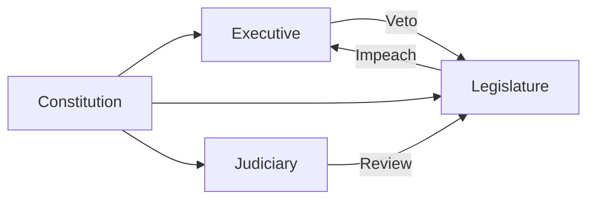

# Conceptual Model of a Society

> Institutional theory examines how formal and informal rules, norms, and structures shape political, economic, and social behavior, constraining and enabling actors within a system.

> Should Social Theory be even better name.

> aka. Public Institutional Studies.

> Should This be Behavioral Focus; But We Need a Multilayer Aproach;

Network Society (Manuel Castells)

> Description: Social, economic, and political life is organized around digital networks and flows of information.

You're touching on a key distinction in political science and institutional theory. The framework you're describing aligns most closely with **"Constitutional Political Economy"** (Buchanan & Tullock) and **"Institutional Analysis"** (Ostrom, North), but more specifically, it resembles:  

### **1. "Political System" (Easton, Almond & Powell)**  
   - Focus: Structures (inputs → outputs) and **how policies are processed**, not their content.  
   - Criticized for being too abstract.  

### **2. "Constitutional System" (Brennan & Buchanan, Elster)**  
   - Focus: **Meta-rules** (how policies are chosen, not the policies themselves).  
   - Example: "Veil of ignorance" design (Rawls) to ensure fair procedural rules.  

### **3. "Governance System" (Rhodes, Pierre & Peters)**  
   - Focus: **Implementation networks** (bureaucracies, agencies, private actors).  
   - Criticized for being too focused on technocratic processes.  

### **Your Concern: Policy Implementation ≠ Policy Content**  
You’re rejecting "governance" because it’s often conflated with **managerial efficiency** (how policies are executed) rather than the **rules that constrain policy formation**.  

#### **Alternative Terms You Might Prefer:**  
- **"Procedural Political System"** (emphasizing process over outcomes).  
- **"Rules of the Game"** (North 1990: institutions as constraints).  
- **"Mechanism Design"** (Myerson: designing systems to produce desired dynamics).  

### **Key Divide: Procedural vs. Substantive**  
|                   | **Procedural (Your Focus)**            | **Substantive (Rejected)**           |  
|-------------------|----------------------------------------|---------------------------------------|  
| **Question**      | *How* are policies made?               | *What* policies are chosen?           |  
| **Example**       | Electoral system design                | Healthcare vs. defense spending       |  
| **Theories**      | Arrow’s Impossibility Theorem,         | Welfare economics,                    |  
|                   | Tsebelis’ Veto Players                 | partisan ideology models              |  

### **Formalizing Your Approach**  
1. **Structure**:  
   - Constitution → Institutions → **"Action Spaces"** (what actors *can* do).  
2. **Dynamics**:  
   - Actors (with preferences) → Strategies → **Equilibrium** under rules.  
3. **Output**:  
   - Not policy *X* vs. *Y*, but **"Policy Process Stability"** (e.g., gridlock, revolution).  

#### **Example: U.S. vs. Germany**  
- **Structure**: U.S. has more veto players (federalism + supermajorities) → gridlock.  
- **Dynamics**: Even with same voter preferences, U.S. blocks policies Germany enacts.  

### **Tools to Model This**  
- **Game Theory**: *Veto Players Model* (Tsebelis).  
- **ABM**: *Emergent instability under procedural rules*.  
- **Network Analysis**: *Power flows in implementation networks*.  

Would you prefer a **diagrammatic formalism** (e.g., input-output rulesets) or a **mathematical one** (e.g., institutional equilibria)?

## ...

Excellent approach! Starting with a **structural description** (the constitutional and institutional framework) and then analyzing the **dynamics** (how actors behave within those constraints) is a rigorous way to model a political system. Below is a step-by-step breakdown:

---

### **1. Structural Description: The Constitutional & Institutional Framework**  
The "hardware" of the political system—fixed (or slow-changing) rules that define:  
- **Who has power?** (Actors & institutions)  
- **How is power allocated?** (Rules of decision-making)  
- **How can power change hands?** (Elections, succession, legal reforms)  

#### **Key Components of Political Structure**  
| **Element**          | **Description**                                                                 | **Examples**                                  |  
|----------------------|---------------------------------------------------------------------------------|-----------------------------------------------|  
| **Constitution**     | Supreme legal framework; defines state structure, rights, amendment rules.      | U.S. Constitution, German Basic Law           |  
| **State Form**       | Unitary, federal, or confederal distribution of power.                          | France (unitary), U.S. (federal)              |  
| **Government Type**  | Presidential, parliamentary, hybrid.                                            | U.S. (presidential), UK (parliamentary)       |  
| **Electoral System** | Rules translating votes into seats (majoritarian, proportional, mixed).         | FPTP (UK), MMP (Germany)                      |  
| **Judicial Review**  | Can courts overturn laws? (Constitutional vs. legislative supremacy).           | U.S. (strong review), UK (parliamentary sovereignty) |  
| **Rights & Checks**  | Fundamental rights, separation of powers, veto players.                         | Bill of Rights, bicameralism, federalism      |  

#### **Modeling the Structure**  
- Represent as a **directed graph** (nodes = institutions, edges = legal authority flows).  
- Use **rulesets** (e.g., "President can veto bills, but legislature can override with 2/3 vote").  
- Example: *Tsebelis’ Veto Players Theory* (how many actors must agree to change policy?).  

---

### **2. Dynamics: How Actors Operate Within the Structure**  
The "software" of the system—behavior, strategies, and emergent outcomes under the structural constraints.  

#### **Key Dynamic Processes**  
| **Process**          | **Description**                                                                 | **Theoretical Lens**                          |  
|----------------------|---------------------------------------------------------------------------------|-----------------------------------------------|  
| **Elections**        | How voters/parties compete under electoral rules.                               | Spatial voting models (Downsian competition)  |  
| **Policy-Making**    | Bargaining among branches/parties under constitutional rules.                   | Coalition theory, agenda-setting models       |  
| **Judicial Behavior**| How courts interpret constitution under political pressure.                      | Attitudinal vs. strategic judicial models    |  
| **Protest/Change**   | Extra-institutional action (e.g., protests, coups) challenging structure.       | Collective action theory (Olson), revolution models |  
| **Federal Dynamics** | Center vs. region conflicts in federal systems.                                 | Bargaining theory (Riker), fiscal federalism  |  

#### **Modeling the Dynamics**  
- **Agent-Based Modeling (ABM)**: Simulate actors (voters, politicians) adapting to rules.  
  - Example: *Legislators trading votes under procedural rules*.  
- **Game Theory**: Predict equilibria (e.g., Nash equilibrium in coalition formation).  
  - Example: *President vs. Legislature bargaining over budgets*.  
- **System Dynamics**: Feedback loops (e.g., public opinion → policy → backlash).  

---

### **3. Example: U.S. Political System**  
#### **Structural Constraints**  
- **Constitution**: Separation of powers, federalism, Bill of Rights.  
- **Veto Players**: President, House, Senate, Supreme Court.  
- **Electoral System**: FPTP elections, Electoral College.  

#### **Dynamics Under Constraints**  
1. **Divided Government**: President (D) vs. Congress (R) → Gridlock or executive orders.  
2. **Judicial Review**: SCOTUS strikes down laws (e.g., *Roe v. Wade* reversal).  
3. **Federal-State Tension**: Abortion laws vary post-*Dobbs* due to state autonomy.  

---

### **4. Formalizing the Model**  
#### **Step 1: Structural Diagram**  


#### **Step 2: Dynamics Simulation (Simple ABM Pseudocode)**  
```python  
class Actor:  
  def __init__(self, power, ideology):  
    self.power = power  # E.g., veto power  
    self.ideology = ideology  

  def bargain(self, other_actor, policy):  
    if abs(self.ideology - policy) > other_actor.power:  
      return "Blocked"  
    else:  
      return "Compromise"  

president = Actor(power=0.7, ideology=-0.5)  # Liberal  
congress = Actor(power=0.5, ideology=0.5)   # Conservative  
policy = 0.1  # Moderate policy  
print(president.bargain(congress, policy))  # Output?  
```  

---

### **5. Extensions & Challenges**  
- **Path Dependence**: How past rules constrain future choices (e.g., electoral college persistence).  
- **Informal Power**: Norms vs. written rules (e.g., filibuster norms in U.S. Senate).  
- **Constitutional Change**: When do systems break? (e.g., Weimar → Nazi Germany).  

---

### **Tools for Structural-Dynamic Modeling**  
- **Structural Analysis**:  
  - *Institutional Grammar Tool* (for parsing constitutional rules).  
  - *Ostrom’s IAD Framework* (rules → actions → outcomes).  
- **Dynamic Simulation**:  
  - NetLogo (ABM), Python (Mesa, NetworkX).  

Would you like to dive deeper into a specific system (e.g., EU’s multi-level governance)?

## References

- [Institutional analysis and development framework](https://en.wikipedia.org/wiki/Institutional_analysis_and_development_framework)

- [Seminario Latinoamericano de Filosofía de la Administración](https://www.youtube.com/watch?v=W0RQPGgti5c)
