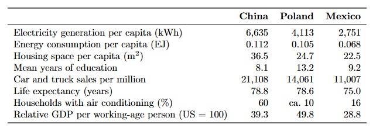

# Poland

Tags: Observatorio
Extra: Reseña
ID: PRO-1307
L: 6
Status: Not started

> …
> 

## Index

## Economic History

> Here's a summarized table outlining key periods and developments in **Poland's economic history**:
> 

| Period | Key Events and Developments |
| --- | --- |
| **10th - 18th Century** | Early medieval economy based on agriculture, trade routes established, periods of prosperity and decline under various dynasties. |
| **1772-1795** | Partitions of Poland by Prussia, Russia, and Austria; economic fragmentation and decline. |
| **1795-1918** | Poland under foreign rule; industrialization in some regions, particularly under Prussian rule. |
| **1918-1939** | Independence regained in 1918; interwar period marked by efforts to modernize and industrialize, significant economic challenges, and the Great Depression. |
| **1939-1945** | World War II devastation; economy severely impacted by war and occupation. |
| **1945-1989** | Post-WWII reconstruction under communist rule; centrally planned economy, focus on heavy industry, nationalization of enterprises. |
| **1989-2004** | Transition to a market economy; economic reforms, privatization, and integration with Western Europe. |
| **2004-Present** | EU membership in 2004; significant economic growth, development of diverse industries, increasing integration into the global economy. |

## Economic Statecraft Institutions

> Here is the updated table including defunct dates for key economic statecraft institutions in Poland, where applicable:
> 

| Institution | Established | Defunct Date | President/Leader | Parent Organization | Key Roles and Functions |
| --- | --- | --- | --- | --- | --- |
| **Ministry of Finance** | 1989 | N/A | Magdalena Rzeczkowska | Government of Poland | Oversees fiscal policy, budgeting, tax administration, and public finances. |
| **National Bank of Poland (NBP)** | 1945 | N/A | Adam Glapiński | Independent institution | Central bank responsible for monetary policy, currency stability, and financial oversight. |
| **Polish Investment and Trade Agency (PAIH)** | 1992 | N/A | Krzysztof Drynda | Ministry of Economic Development and Technology | Promotes foreign investment and supports Polish businesses in international markets. |
| **Polish Agency for Enterprise Development (PARP)** | 2000 | N/A | Małgorzata Oleszczuk | Ministry of Economic Development and Technology | Supports SMEs, innovation, and entrepreneurship through various programs and funding. |
| **Industrial Development Agency (ARP)** | 1991 | N/A | Cezariusz Lesisz | Government of Poland | Supports industrial restructuring, innovation, and investment in strategic sectors. |
| **Office of Competition and Consumer Protection (UOKiK)** | 1990 | N/A | Tomasz Chróstny | Government of Poland | Ensures fair competition, consumer rights protection, and market regulation. |
| **Polish Development Fund (PFR)** | 2016 | N/A | Paweł Borys | Government of Poland | Provides financial instruments for development projects, including investments in infrastructure and innovation. |
| **Statistics Poland (GUS)** | 1918 | N/A | Dominik Rozkrut | Government of Poland | National statistical agency responsible for collecting and analyzing economic data. |
| **Bank Gospodarstwa Krajowego (BGK)** | 1924 | N/A | Beata Daszyńska-Muzyczka | Government of Poland | State development bank that supports social and economic growth projects. |
| **Polish Financial Supervision Authority (KNF)** | 2006 | N/A | Jacek Jastrzębski | Government of Poland | Supervises the financial market, including banking, insurance, and capital markets. |

## R&D Actors

> Here's a detailed table summarizing key Research and Development (R&D) actors in Poland, including their establishment dates, defunct dates (if applicable), presidents or leaders, parent organizations, and primary focus areas:
> 

| Institution | Established | Defunct Date | President/Leader | Parent Organization | Primary Focus Areas |
| --- | --- | --- | --- | --- | --- |
| **Polish Academy of Sciences (PAN)** | 1952 | N/A | Jerzy Duszyński | Independent | Multidisciplinary scientific research |
| **National Centre for Research and Development (NCBR)** | 2007 | N/A | Wojciech Kamieniecki | Ministry of Science and Higher Education | Funding and supporting research and innovation |
| **Institute of Fundamental Technological Research (IPPT PAN)** | 1953 | N/A | Leszek A. Dobrzański | Polish Academy of Sciences | Applied research in engineering and technology |
| **Łukasiewicz Research Network** | 2019 | N/A | Piotr Dardziński | Ministry of Economic Development | Applied research and development in various industries |
| **Institute of Physics, Polish Academy of Sciences** | 1953 | N/A | Roman Sobolewski | Polish Academy of Sciences | Research in physics, materials science, and nanotechnology |
| **Polish Institute of Energy** | 1956 | N/A | Henryk Majchrzak | Ministry of Energy | Research in energy technologies and policy |
| **Institute of Biotechnology and Antibiotics (IBA)** | 1983 | N/A | Andrzej D. Kozłowski | Ministry of Science and Higher Education | Research in biotechnology and pharmaceuticals |
| **Institute of Agricultural and Food Biotechnology (IBPRS)** | 1952 | N/A | Jan Krzysztof Ardanowski | Ministry of Agriculture and Rural Development | Research in food technology, agriculture, and biotechnology |
| **Space Research Centre (CBK PAN)** | 1977 | N/A | Iwona Stanisławska | Polish Academy of Sciences | Research in space and satellite technology |
| **Institute of Organic Chemistry, Polish Academy of Sciences** | 1964 | N/A | Bogdan Marciniec | Polish Academy of Sciences | Research in organic chemistry and materials science |

## Industrial Policy

Here is a detailed table summarizing key periods and developments in Poland's industrial policy:

| Period | Key Policies and Developments |
| --- | --- |
| **Pre-World War II (1918-1939)** | - Rebuilding the economy after independence in 1918. - Focus on industrialization, especially in mining, steel, and manufacturing. - Establishment of the Central Industrial Region (COP) to promote heavy industry and defense. |
| **Post-World War II (1945-1989)** | - Central planning under communist rule. - Nationalization of industries. - Focus on heavy industry, mining, and steel production. - Establishment of large state-owned enterprises (SOEs). - Industrial policy directed by Five-Year Plans. |
| **Transition Period (1989-2004)** | - Shift from a centrally planned to a market economy. - Privatization of state-owned enterprises. - Structural reforms to liberalize the economy. - Emphasis on attracting foreign direct investment (FDI). - Integration into the European Union (EU) initiated. |
| **EU Membership (2004-Present)** | - EU membership in 2004, leading to regulatory alignment with EU standards. - Focus on modernization and innovation. - Development of high-tech industries, including IT and electronics. - Emphasis on small and medium-sized enterprises (SMEs) and entrepreneurship. - Utilization of EU structural funds for regional development. - Promotion of sustainable and green technologies. |
| **Recent Developments (2010s-2020s)** | - Emphasis on Industry 4.0 and digital transformation. - Development of special economic zones (SEZs) to attract investment. - Implementation of the "Strategy for Responsible Development" focusing on innovation, infrastructure, and human capital. - Support for research and development (R&D) and collaboration between industry and academia. - Focus on energy transition and reducing carbon emissions. |

## Economic Sectors

Here is an updated table summarizing the key economic sectors in Poland, including their importance and contribution to GDP:

| Economic Sector | Description and Key Developments | GDP Contribution (%) |
| --- | --- | --- |
| **Agriculture** | - Historically significant, now modernized and highly productive. - Major products include grains, potatoes, sugar beets, and dairy. | 2.5% |
| **Mining and Quarrying** | - Rich in natural resources, especially coal and copper. - Key industries include coal mining, copper mining, and salt extraction. | 2.2% |
| **Manufacturing** | - Diverse sector including automotive, machinery, electronics, and chemicals. - Growth driven by foreign investment and export-oriented production. | 18.5% |
| **Energy** | - Mix of coal, renewables, and natural gas. - Focus on energy transition and reducing reliance on coal. - Development of wind and solar energy projects. | 3.0% |
| **Construction** | - Significant growth driven by infrastructure development and urbanization. - Includes residential, commercial, and public infrastructure projects. | 6.5% |
| **Information and Communication Technologies (ICT)** | - Rapidly growing sector. - Strong presence in software development, IT services, and telecommunications. - Increasing role in digital economy initiatives. | 7.0% |
| **Financial Services** | - Well-developed banking, insurance, and investment sectors. - Warsaw Stock Exchange is a key regional financial hub. - Growth in fintech and digital banking. | 4.5% |
| **Retail and Wholesale Trade** | - Major contributor to GDP. - Includes both domestic and international trade. - Growth of e-commerce and modern retail formats. | 15.0% |
| **Tourism and Hospitality** | - Growing sector with attractions including historical sites, natural landscapes, and cultural events. - Development of wellness and eco-tourism. | 2.5% |
| **Transport and Logistics** | - Extensive network of roads, railways, ports, and airports. - Key transit hub in Central and Eastern Europe. - Growth in logistics and warehousing. | 6.0% |
| **Healthcare and Pharmaceuticals** | - Advanced healthcare services and significant pharmaceutical production. - Growth in medical tourism. - Increasing investment in biotech and medical research. | 5.0% |
| **Education and Research** | - Strong emphasis on higher education and research institutions. - Significant R&D activities across various fields. - Collaboration between academia and industry. | 1.5% |
| **Creative Industries** | - Includes media, entertainment, design, and gaming. - Known for innovation and global presence in certain niches like game development. | 1.8% |

## Economic Statesman

Here's a detailed table summarizing key economic and industrial strategists in Poland, highlighting their contributions and roles in shaping the country's economic and industrial policies:

| Name | Period | Role/Position | Key Contributions and Policies |
| --- | --- | --- | --- |
| **Władysław Grabski** | 1923-1925 | Prime Minister, Minister of Treasury | Introduced the zloty, stabilized the economy post-WWI, and initiated economic reforms. |
| **Eugeniusz Kwiatkowski** | 1926-1930, 1935-1939 | Minister of Industry and Trade | Architect of the Central Industrial Region (COP), promoting heavy industry and infrastructure development. |
| **Edward Gierek** | 1970-1980 | First Secretary of the Polish United Workers' Party | Modernized industry through foreign loans, expanded industrial capacity, and improved living standards. |
| **Leszek Balcerowicz** | 1989-1991, 1997-2000 | Deputy Prime Minister, Minister of Finance | Implemented "shock therapy" economic reforms to transition from a centrally planned economy to a market economy. |
| **Jerzy Hausner** | 2003-2005 | Deputy Prime Minister, Minister of Economy and Labor | Developed the "Hausner Plan" for economic recovery and public sector reform. |
| **Marek Belka** | 2004-2005 | Prime Minister, President of the National Bank of Poland (2010-2016) | Guided Poland through EU accession and promoted monetary stability. |
| **Mateusz Morawiecki** | 2015-present | Prime Minister, previously Minister of Development, Minister of Finance | Advocated for the "Strategy for Responsible Development," focusing on innovation, infrastructure, and social equity. |
| **Elżbieta Bieńkowska** | 2014-2019 | European Commissioner for Internal Market, Industry, Entrepreneurship and SMEs | Promoted industrial competitiveness and SME growth at the European level. |
| **Henryka Bochniarz** | 1999-present | President of the Polish Confederation Lewiatan | Advocates for business-friendly policies and supports economic reforms to enhance Poland's competitiveness. |
| **Tadeusz Kościński** | 2019-2021 | Minister of Finance | Focused on digital transformation, tax system reforms, and supporting businesses during the COVID-19 pandemic. |

## R&D Actors

As of my last knowledge update in January 2022, I can provide a general overview of Poland's research and development (R&D) actors. Remember that the landscape may have changed, and new organizations may have emerged since then. Here are some key R&D actors in Poland:

1. **National Science Center (NCN):** The NCN is a governmental agency supporting fundamental research across various disciplines in Poland.
2. **National Centre for Research and Development (NCBR):** NCBR is a government agency implementing national R&D programs and initiatives.
3. **Polish Academy of Sciences (PAN):** PAN is a major scientific institution in Poland, comprising a network of research institutes and centers covering various scientific disciplines.
4. **Ministry of Science and Higher Education:** The government ministry responsible for science and higher education policies, funding, and coordination of R&D activities.
5. **National Information Processing Institute (OPI PIB):** OPI PIB is involved in information technology research and development, focusing on applications in various sectors.
6. **Wrocław Technology Park:** An example of a technology park in Poland that facilitates collaboration between businesses, academia, and research institutions to drive innovation.
7. **Łukasiewicz Research Network:** Formerly known as the **Institute of Precision Mechanics**, it is part of the Łukasiewicz Research Network, which consists of numerous research institutes covering various fields.
8. **Innovation and Industry Liaison Office (IILO):** Many universities in Poland, such as Warsaw University of Technology and Jagiellonian University, have offices dedicated to fostering collaboration between academia and industry.
9. **Science and Technology Parks:** Various science and technology parks across the country provide infrastructure and support for R&D activities. Examples include Gdańsk Science and Technology Park and Poznań Science and Technology Park.
10. **European Funds:** Poland also receives funding from European Union research programs, such as Horizon Europe, which supports R&D initiatives.

## GDP Measurement

While World Bank claims Poland has twice GDP per capita of China, if you look at these indicators, it appears that Chinese living standards are higher.

Poland's living standards appear to be, in fact, midway between China's and Mexico's (note I corrected Poland's energy consumption, the previous datapoint of 0.065 was the Romanian level).

> Mean years of schooling of China is strange, 8.1 yrs (HDI data) are even lower than Congo. 2020 census puts it at 9.5 years (>25yrs old). HDI in 2018 also mysteriously used 7.8 years from the Barro & Lee (2016) which itself says 7.8 is 2005’s level and it was 8.14 yrs in 2015.

> several of these indicators like  electricity generation per capita, energy consumption per capita relate rather to the industry contribution to GDP than to the standard of living

> Their correlation with GDP per capita is higher than years of schooling, the only indicator where Poland performs better than China.

> Also, energy/electricity consumption tends to be higher in countries with low population density like US and Canada. South Korea and Germany are much more industrialized but consume less electricity.

> I agree they can be misleading. Thats why I presented eight indicators besides one.

> The point of the exercise is to show that even GDP PPP can also be misleading.

> You can get a “sugar high” in growth by pushing fertility very low, below replacement People work a lot, save the money, and to the extent they have kids, invest a lot in a few kids While this turbo charges growth, it’s hard to get out of the resulting low fertility equilibrium

## References

- [https://en.wikipedia.org/wiki/National_Centre_for_Research_and_Development](https://en.wikipedia.org/wiki/National_Centre_for_Research_and_Development)
- [https://en.wikipedia.org/wiki/Polish_Development_Fund](https://en.wikipedia.org/wiki/Polish_Development_Fund)
- [https://en.wikipedia.org/wiki/National_Development_Bank_(Poland)](https://en.wikipedia.org/wiki/National_Development_Bank_(Poland))
- [https://www.arp.gda.pl/](https://www.arp.gda.pl/)
- [https://kuke.com.pl/en/about-us](https://kuke.com.pl/en/about-us)
- [https://www.esteri.it/en/sala_stampa/archivionotizie/diplomazia-economica/2024/09/polonia-il-governo-da-impulso-ai-progetti-industriali/](https://www.esteri.it/en/sala_stampa/archivionotizie/diplomazia-economica/2024/09/polonia-il-governo-da-impulso-ai-progetti-industriali/)
- [https://press.wz.uw.edu.pl/cgi/viewcontent.cgi?article=1032&context=monographs](https://press.wz.uw.edu.pl/cgi/viewcontent.cgi?article=1032&context=monographs)

00101231983