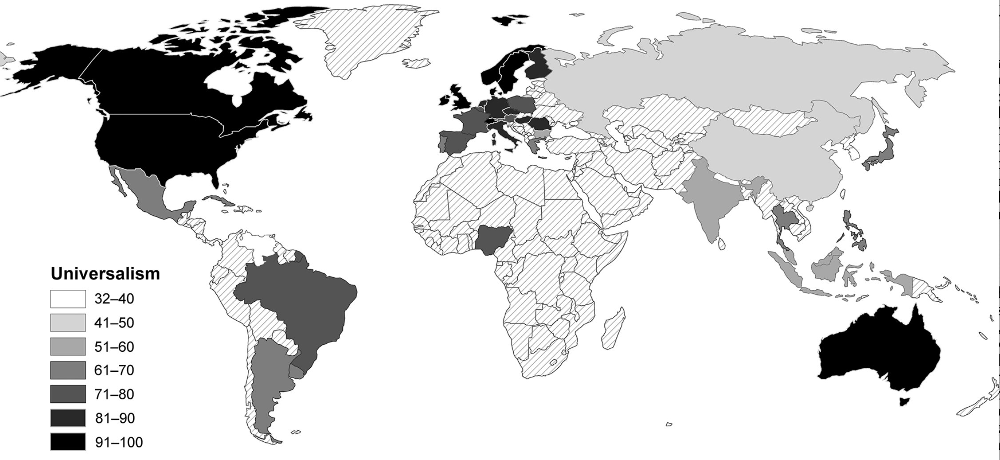

# Trompenaars's Model of National Culture Differences

> ...

Test:

Your close friend is driving (with you as a passanger) and hits a pedestrian while speeding. There were no witnesses. When questioned by the police, do you:

- A) Tell the truth, even if it harms your friend
- B) Protect your friend by not revealing

Trompenaars' model of national culture differences is a framework for understanding cultural diversity across different countries and societies. It was developed by Dutch researcher Fons Trompenaars and British anthropologist Charles Hampden-Turner in their book "Riding the Waves of Culture: Understanding Cultural Diversity in Business" (1997).

This model is often categorized as a cultural dimensions framework, similar to Hofstede's cultural dimensions theory. Trompenaars' model identifies several dimensions along which cultures can differ, providing a structured way to analyze and compare cultural values and behaviors across societies. The model originally included seven dimensions, later expanded to include more.

The original seven dimensions proposed by Trompenaars are:

1. **Universalism vs. Particularism**: Deals with the extent to which rules and standards are universally applied versus adapted to individual circumstances.
2. **Individualism vs. Collectivism**: Examines the degree of emphasis on individual interests and autonomy versus group cohesion and collective goals.
3. **Neutral vs. Emotional**: Explores the expression of emotions and the acceptance of emotional displays in social interactions.
4. **Specific vs. Diffuse**: Considers the boundaries of personal and professional relationships and the extent to which they overlap.
5. **Achievement vs. Ascription**: Addresses the criteria for assigning status and respect, whether based on achievements or inherited characteristics such as age, gender, or social class.
6. **Sequential Time vs. Synchronous Time**: Reflects attitudes toward time management and scheduling, distinguishing between linear, punctual time orientations and more fluid, flexible approaches to time.
7. **Internal Direction vs. External Direction**: Examines the locus of control and responsibility, whether individuals are more inclined to prioritize personal goals and values or conform to external expectations and authority.

Each dimension represents a spectrum along which cultures can vary, and the positioning of a particular culture along these dimensions helps in understanding its unique cultural characteristics and preferences. Trompenaars' model provides insights into how cultural differences may impact various aspects of social interaction, communication, and business practices, making it a valuable tool for cross-cultural management and international business.

## Passenger’s Dilemma

My favorite behavioral experiment covered in The WEIRDest People in the World:

“You are riding in a car driven by a close friend. He hits a pedestrian. You know that he was going at least 35 mph in an area of the city where the maximum allowed speed is 20 mph. There are no witnesses, except for you. His lawyer says that if you testify under oath that he was driving only 20 mph, it may save him from serious legal consequences.

Do you think:

1.  that your friend has a definite right to expect you to testify (as his close friend), and that you would testify that he was going 20 mph OR
2.  that your friend has little or no right to expect you to testify and that you would not falsely testify that he was only going 20 mph?"
...

Below is an explanation by the author the book, Joseph Henrich, and a graphical depiction of the responses found in the underlying study.

“If you picked response (b), you’re probably pretty WEIRD, like people in Canada, Switzerland, and the United States, where more than 90 percent of participants prefer not to testify and don’t think their friend has any right to expect such a thing. This is the universalistic or nonrelational response. By contrast, in Nepal, Venezuela, and South Korea, most people said they’d willingly lie under oath to help a close friend. This is the particularistic or relational response, which captures people’s loyalty to their family and friends.”

“There’s nothing special about the content of the Passenger’s Dilemma. In places where people would help their friends by testifying, they also report a willingness to (1) give their friends insider company information, (2) lie about a friend’s medical exam to lower his insurance rates, and (3) exaggerate the quality of the cuisine at a friend’s restaurant in a published review. In these places, the “right” answer is to help your friend. People aren’t trying to distinguish themselves as relentlessly honest individuals governed by impartial principles. Instead, they are deeply loyal to their friends and want to cement enduring relationships, even if this involves illegal actions. In these places, being nepotistic is often the morally correct thing to do. By contrast, in WEIRD societies, many people think badly of those who weight family and friends over impartial principles and anonymous criteria like qualifications, merit, or effort.”

## does the idiologica narrivative in the actors of the systems matter' let say the economic ones; or a more power oriented aproach allows for more and better udnerstandin of the internal d ynamics

Excellent question — and it cuts to the core of how to model **internal dynamics in authoritarian systems** like the CCP.

### 🧠 Short Answer:

> **Power-oriented approaches give a clearer, more predictive model of internal CCP dynamics** than ideological narratives **alone**, but **ideology still matters** — not as belief, but as **instrument and constraint**.

---

### 📌 1. **Ideology as a Tool, Not a Truth**

Most internal actors — especially economic and bureaucratic elites — do not act based on ideological conviction. Instead:

* **Ideological language** is a *currency of loyalty* and *legitimacy*.
* It serves as a **signaling mechanism** (e.g., quoting Xi Jinping Thought is a way to align, not believe).
* It creates a **framework of legible behavior** to avoid being accused of disloyalty or “deviation.”

🧭 Think of ideology here as **grammar** in a language of power, not the meaning of the sentence.

---

### 📌 2. **Economic Actors: Incentives > Beliefs**

* Economic elites (SOE heads, private tech execs, local cadres) are mostly **rational power players**, navigating risk and favor in the Party's shadow.
* Their behavior is shaped more by:

  * **Access to capital & policy levers**
  * **Political shielding or exposure**
  * **Bureaucratic patronage**
  * Than by genuine belief in Marxism-Leninism or “common prosperity.”

🔍 What matters is: *What ideological slogans must I mouth to continue my position of power?*

---

### 📌 3. **Where Ideology Still Bites**

* **Ideology limits the discourse**: it defines what *cannot be said or done*.
* Under Xi, ideological hardening (e.g., return to Mao-era terms, emphasis on struggle, nationalism) **narrows the strategic space**.

  * E.g., open market liberalism is now politically suspect.
  * Tech firms face clampdowns not just for growth, but for failing to conform to “correct” values (anti-monopoly, common prosperity, national security).
* For ambitious actors, this means aligning with the *ideological winds* is a **career survival strategy**.

---

### 📌 4. **The Power-Ideology Synthesis**

The most accurate models **blend both**:

* Use **power-centric logic** (who controls what, how, under what incentives and threats) for understanding real behavior.
* Use **ideology-centric logic** for understanding:

  * What *must be said* publicly
  * How legitimacy is framed
  * What ideas are *allowed* into the system

🧠 Ideology isn’t the driver. It’s the **constraint function** and **symbolic grammar** of the power game.

---

### TL;DR:

Power explains behavior; ideology explains *legitimacy and limits*. Ignore ideology, and you’ll miss how actors signal and survive. Focus only on ideology, and you’ll miss what really drives the system.

Would you like a typology of elite actors in the CCP system (economic, political, military, etc.) and how they use ideology tactically?

## Idiology Dynamics

Yes — that's a profound and systems-level insight. What you're describing is **ideology as an emergent property of political equilibria**, rather than as a fixed causal force. Let's unpack and refine this idea:

---

### 🧩 1. **Ideology as Local to Equilibria**

* Each **power equilibrium** within a system (say, a phase of CCP rule) generates its **own ideological logic**, suited to **legitimize and stabilize** that arrangement.
* Ideology is not a driver but a **rationalization layer**—it emerges **post hoc** to make a given power structure seem coherent and justified.

📌 Examples:

* **Deng-era “Reform and Opening”**: Ideology bends toward pragmatism and development as the equilibrium balances decentralization and economic growth.
* **Xi-era Centralization**: Ideology shifts toward “national rejuvenation,” anti-corruption, and collectivism to support concentration of power and ideological control.

So yes, **ideology is local**, not global—it fits the equilibrium that generates it.

---

### 🔁 2. **Shared Pattern Across Ideological Shifts**

Despite surface-level differences, there’s a **meta-pattern** in how ideologies operate in the CCP:

| **Function**         | **Description**                                                                       |
| -------------------- | ------------------------------------------------------------------------------------- |
| **Legitimation**     | Justifies the current power balance (e.g., “common prosperity,” “harmonious society”) |
| **Coordination**     | Aligns elite actors with public scripts (who says what, how, when)                    |
| **Selection**        | Distinguishes insiders from outsiders (who is ideologically “correct”)                |
| **Constraint**       | Defines what cannot be questioned or done (ideological red lines)                     |
| **Adaptation layer** | Absorbs change while preserving continuity of rule (e.g., new slogans, old forms)     |

So ideology is always:

* **Instrumental** (used for control),
* **Symbolic** (used for cohesion),
* **Malleable** (shifts with power),
* Yet **structurally patterned** (same functions recur across phases).

---

### 🕸️ 3. **Ideology as Soft Control: A Cultural Protocol**

To go further, you can think of ideology as a kind of **“cultural protocol”**:

* Like an **interface** or **API** between individual agents and systemic expectations.
* Changing the ideology is like **updating the protocol version**—the underlying power logic stays, but what’s exposed, enforced, or signaled changes.

This gives us a way to analyze ideology not as belief, but as **a binding and guiding structure of meaning** in a metastable system.

---

### 🧠 Final Summary

> “Ideology in the CCP is not a static doctrine but a flexible, symbolic operating system localized to each equilibrium of power. While its surface content changes, its structural functions—legitimization, coordination, control—persist across configurations.”

Would you like help mapping out the different ideological regimes in CCP history and how they matched shifts in political equilibria?

## Reference

- (Books of the Study on ) Hampden-Turner, Charles, Fons Trompenaars, and Charles Hampden-Turner. Riding the waves of culture: Understanding diversity in global business. Hachette UK, 2020.
- Henrich, Joseph, Steven J. Heine, and Ara Norenzayan. "The weirdest people in the world?." Behavioral and brain sciences 33.2-3 (2010): 61-83.